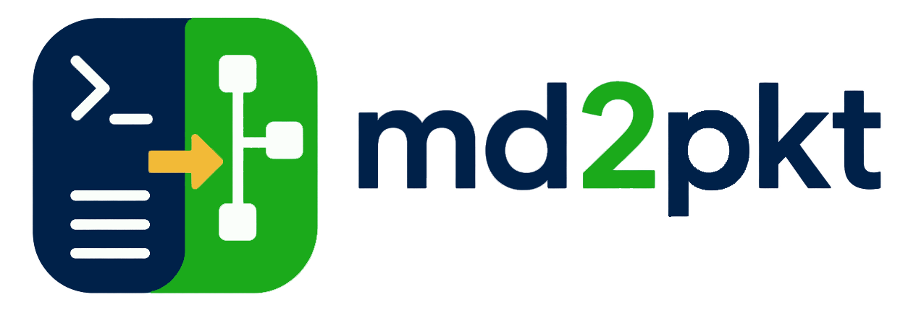

<p align="center">
  
</p>

<p align="center">
  <a href="https://www.npmjs.com/package/md2pkt"></a>
  <a href="LICENSE"></a>
</p>

---

`md2pkt` is a Windows-first CLI that turns Markdown or text-based PDF network assignments into Cisco Packet Tracer `.pkt` files. it reads the instructions, normalizes the topology, plans the missing details, generates PTBuilder JavaScript and IOS config, then sends the build to a local Packet Tracer bridge.

the first target is CCNA-style lab work: routers, switches, PCs, servers, DHCP, static routing, OSPF, EIGRP, RIP, and simple LAN/WAN layouts. Packet Tracer stays the source of truth for the final `.pkt` file.

[npm](https://www.npmjs.com/package/md2pkt) | [github](https://github.com/Microck/md2pkt)

## why

Packet Tracer labs often start as a paragraph, rubric, or PDF assignment. `md2pkt` gives that text a direct path into a runnable topology without turning the workflow into a manual redraw.

- accepts `.md`, `.txt`, and text-based `.pdf` inputs
- uses deterministic defaults when an assignment leaves details out
- prefers `codex exec` for one-turn planning, with OpenAI API and deterministic fallback paths
- generates deployable PTBuilder JavaScript and per-router IOS config artifacts
- targets a small local bridge protocol instead of a full Packet Tracer replacement
- includes Windows Explorer right-click registration for `.md` and `.pdf`

## quickstart

from a checkout:

```bash
npm install
npm run build
npm link
```

check the local machine:

```bash
md2pkt doctor
```

install the Packet Tracer bridge bootstrap:

```bash
md2pkt bridge install
```

open Cisco Packet Tracer, go to **Extensions -> Builder Code Editor**, paste the printed bootstrap script, and run it. then build a lab:

```bash
md2pkt build assignment.md --out assignment.pkt --engine auto
```

## inputs

`md2pkt build` accepts:

| input | support |
| --- | --- |
| `.md` | read directly |
| `.txt` | read directly |
| `.pdf` | converted through a MarkItDown-compatible CLI |

text-based PDFs are in scope for v1. scanned PDFs need OCR before `md2pkt` can reliably infer a topology.

## command surface

| command | purpose |
| --- | --- |
| `md2pkt build <file> --out <file.pkt>` | convert an assignment into a queued Packet Tracer build |
| `md2pkt doctor` | check Node.js, Codex, MarkItDown, OpenAI API, bridge, and Packet Tracer signals |
| `md2pkt bridge install` | write the PTBuilder bootstrap script and print setup instructions |
| `md2pkt bridge status` | check the local bridge endpoint |
| `md2pkt bridge repair` | rewrite the bootstrap script |
| `md2pkt context-menu install` | add Explorer right-click actions for `.md` and `.pdf` |
| `md2pkt context-menu remove` | remove those Explorer actions |

engine selection:

```bash
md2pkt build lab.md --out lab.pkt --engine auto
md2pkt build lab.md --out lab.pkt --engine codex
md2pkt build lab.md --out lab.pkt --engine api
```

`auto` tries Codex first, then the OpenAI API when `OPENAI_API_KEY` is set, then deterministic inference.

## bridge model

`md2pkt` targets a PTBuilder polling bridge on `http://127.0.0.1:54321`.


the bridge protocol is intentionally small:

| endpoint | purpose |
| --- | --- |
| `GET /status` | reports bridge health |
| `POST /enqueue` | accepts `{ "script": "...", "out": "C:\\path\\file.pkt" }` |
| `GET /next` | returns the next PTBuilder script for Packet Tracer to run |

the Packet Tracer side polls `/next` from the Builder Code Editor and runs returned JavaScript through `$se('runCode', ...)`.

## generated artifacts

each build writes sidecar files next to the requested `.pkt` path:

| artifact | purpose |
| --- | --- |
| `<out>.ptbuilder.js` | Packet Tracer deployment script |
| `<out>.ios.txt` | generated IOS config blocks |
| `<out>.md2pkt-report.json` | normalized topology, assumptions, warnings, and human report |

these files make the build inspectable even when Packet Tracer or the bridge is unavailable.

## assumptions

v1 makes deterministic assumptions instead of asking follow-up questions:

- no router count means one router
- no switch count means one access switch per router LAN
- no host count means two PCs
- multi-router topologies use static routing unless OSPF, EIGRP, or RIP is requested
- LANs use sequential `192.168.x.0/24` networks
- inter-router links use sequential `10.0.x.0/30` networks

assumptions and warnings are written into the build report.

## windows explorer

register right-click actions for `.md` and `.pdf`:

```powershell
md2pkt context-menu install
```

after registration, right-click an assignment file and choose **Build Packet Tracer .pkt**. the output path uses the same basename with a `.pkt` extension.

remove the entries:

```powershell
md2pkt context-menu remove
```

## development

```bash
npm install
npm run typecheck
npm test
npm run build
```

the test suite uses a local fake bridge, so it does not require Cisco Packet Tracer.

## current boundaries

- Cisco Packet Tracer 8.2+ must already be installed.
- `.pkt` is the canonical output. `.pkz` is out of scope for v1.
- the deterministic generator records VLAN, NAT, and ACL intent but does not fully configure those features yet.
- real `.pkt` saving depends on the PTBuilder environment exposing a save function.
- the upstream bridge reference inspected for this project is `Mats2208/MCP-Packet-Tracer`, which is MIT-licensed.

## license

MIT, matching the package metadata.
